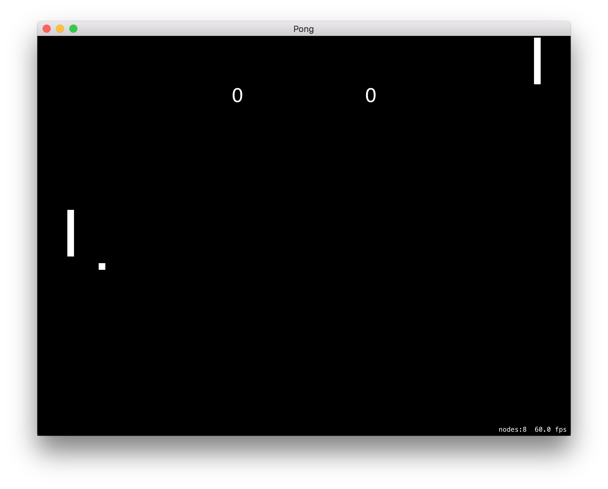
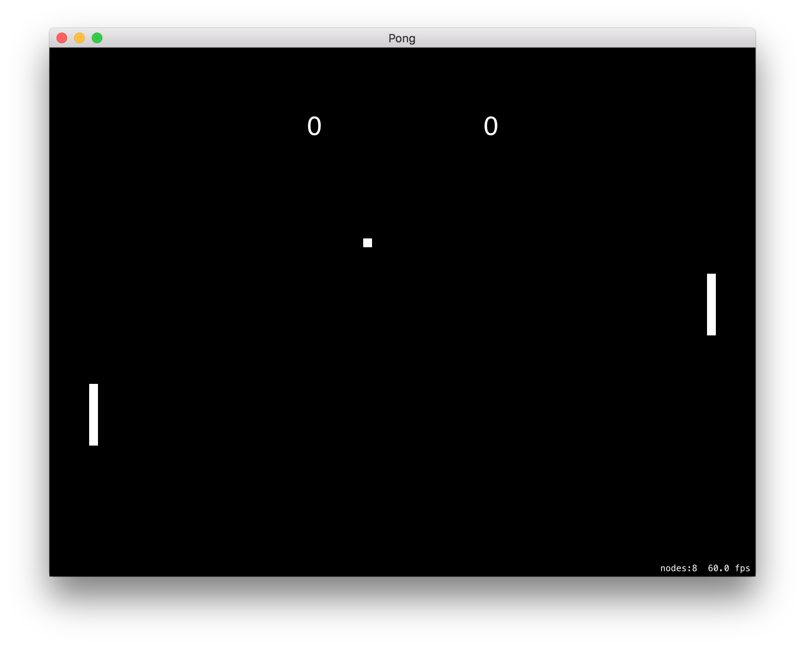
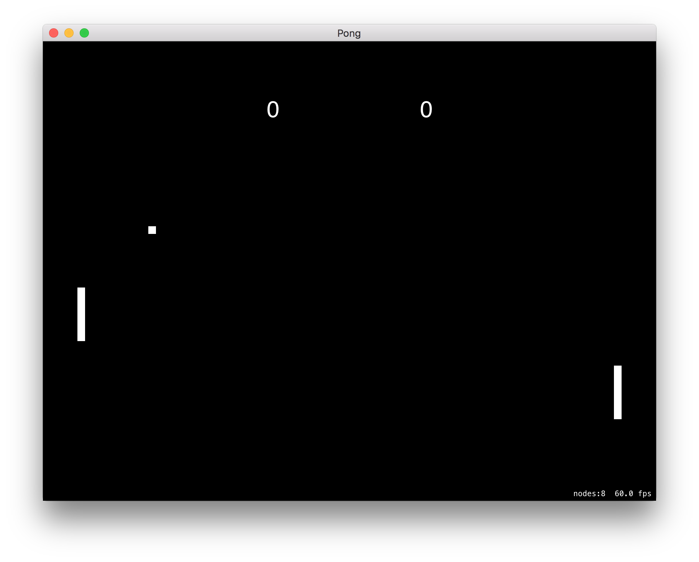
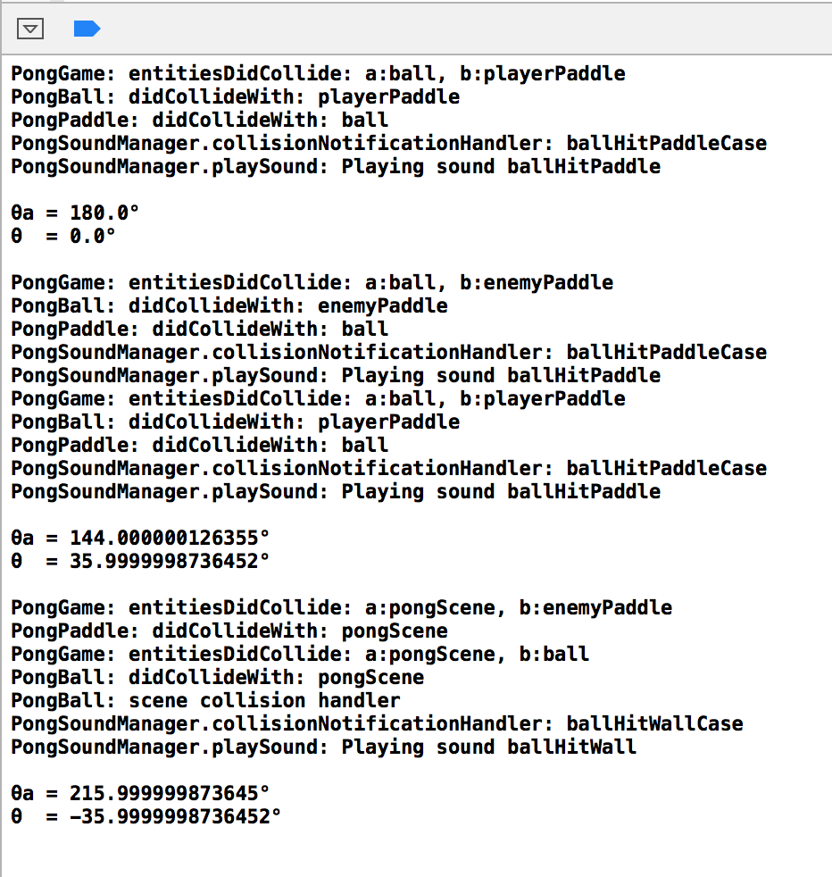
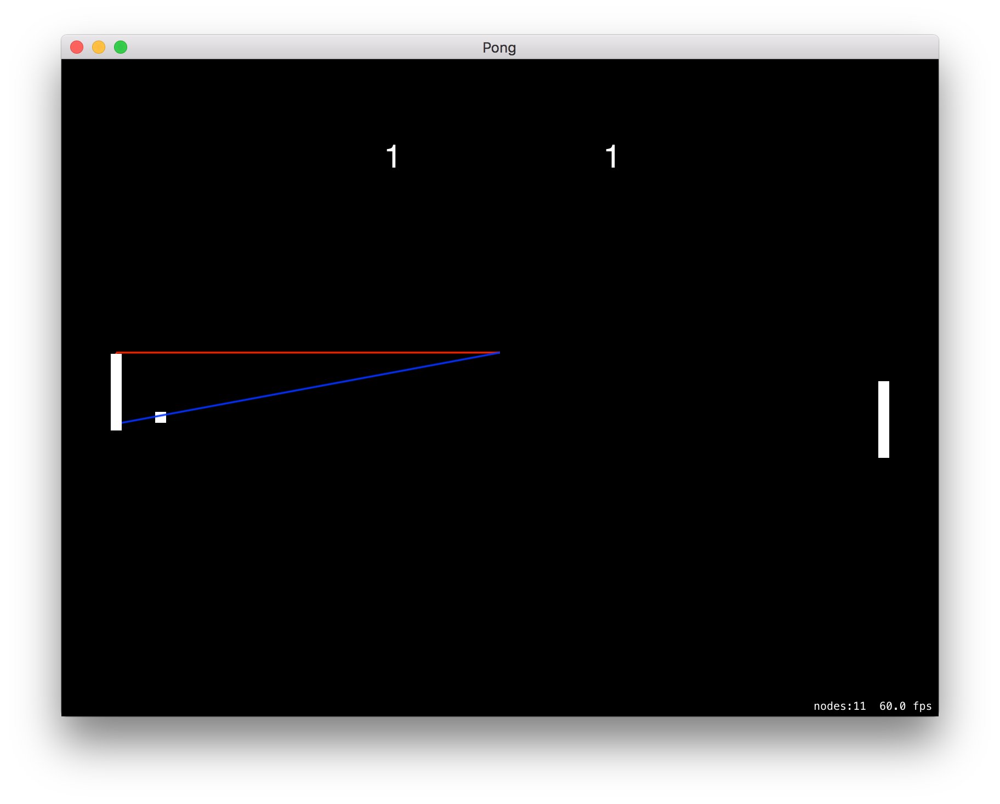
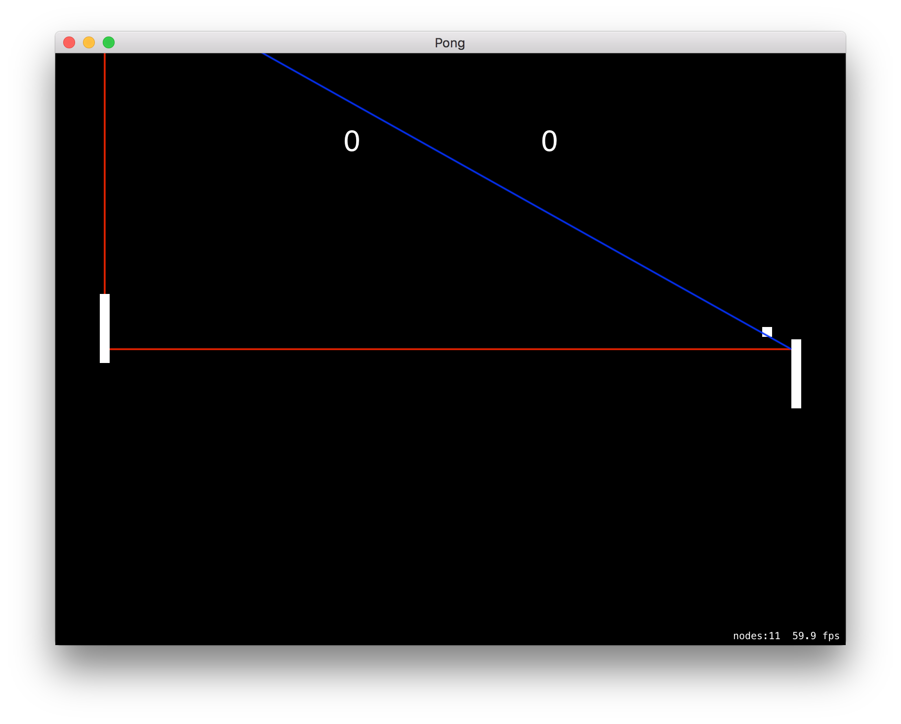

# pong

This is my implementation of the classic video game Pong in Swift using the SpriteKit graphics library. The source code in its entirety can be found in the `Pong` subfolder (this is the default Xcode project structure). It has not been modified recently, however, the commit history is publicly reviewable.
The nature of this project is a simple Pong game that showcases different AIs and how they work. There are two AI categories: `PongBasicPlayer` and `PongTrigPlayer`.

## Build instructions

Due to Swift's transient state and the application's dependency upon target-specific bindings like `NSWindow`, as well as closed libraries like `SpriteKit`, this program has strict build requirements.

This is a **Swift 2.2** application targeting the latest public version of **OS X El Capitan**.

To build and run, open the Xcode project file (included) in Xcode and build it through there. You can even run it directly after building by pressing the ▶️ button. Because it is Swift 2.2, I advise using the latest App Store version of Xcode.

Once built, the program will either run immediately, or, if you specificied **Build Only**, the application binary will appear in the **Products** folder in the Xcode left side tree, allowing you to access the binary directly.

## Screenshots

A rousing game against the `PongBasicPlayer` AI. They make this shot. The `PongBasicPlayer` is a synchronous state machine that makes a "decision" on a certain interval that involves changing its state (Up, Down, or None), and this state is continuously fed to the paddle object on screen to control its movement. The only input of the decision machine is the paddle's Y position and the ball's Y position.

If we didn't hinder this AI, it would literally be perfect, moving to the ball's Y position with no delay. Instead, we throw some curveballs: 

1. The movement speed of the enemy paddle is slowed
2. The position of the ball is sent through a Signal Delay mechanism to produce perceptive delay (lag)
3. The position of the ball can, in some circumstances, be randomly "jittered" (made inaccurate within a small margin)
4. The paddle can only react once the ball is both moving left and in the left half of the court
5. The paddle can only make a decision on a limited interval
6. Sometimes, on a random probability, the paddle won't make a proper decision, but will instead "persist" the prior state, which is equivalent to a bad reaction, leading to the paddle going too far

A perfect example of the above hindrances, well, hindering `PongBasicPlayer`. Unfortunately, this is one of several misses for them.

Some sample log output as the game manages a number of collision events and resulting physics calculations regarding reflection, scoring, and AI decisionmaking.

The `PongTrigPlayer` is _very_ different from their sibling AI. This AI is not a continuous state machine and does not take into account the updating movement of the ball. Instead, every time the ball bounces (against a wall or paddle), if the ball is then heading towards the AI, it will make a trigonometric projection of where the ball will be and immediately move towards that Y. (technically the mechanism that moves towards the Y is itself a state machine)

Because `PongTrigPlayer` isn't constantly making new decisions, but instead stubbornly sticking to its initial judgment, we don't have to make as many compromises to slow it down. The biggest hindrance to `PongTrigPlayer` is the wild imprecision of the floating point numbers this engine (`SpriteKit`) uses to represent velocity vectors, and as a derived value, angles. Here you can see the ball begin to deviate from the projection.
